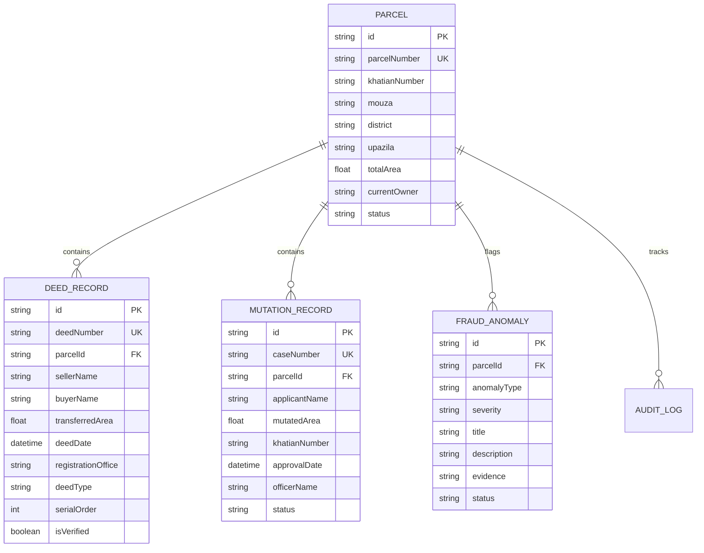

# LandTrace: Technical Architecture & System Design
## LandTech 2026 — Problem Statement P3

---

### 1. High-Level Architecture Overview

LandTrace is architected as an end-to-end cloud-native web platform utilizing a modular topological contradiction engine.

```text
┌────────────────────────────────────────────────────────┐
│            Presentation Layer (Officer UI)             │
│  - Bilingual Support (বাংলা default / English)         │
│  - Next.js 16 App Router + React 19 Client Components  │
│  - Tailwind CSS v4 Government-Style Theme              │
└───────────────────────────┬────────────────────────────┘
                            │
                            ▼
┌────────────────────────────────────────────────────────┐
│             Application & Business Logic Layer         │
│  - Next.js Server Components & Route Handlers          │
│  - Pure TypeScript Contradiction Detection Engine      │
│  - Pre-Registration Simulation Service                 │
└───────────────────────────┬────────────────────────────┘
                            │
                            ▼
┌────────────────────────────────────────────────────────┐
│               Data Persistence Layer                   │
│  - Prisma 6 ORM Client                                 │
│  - Neon Serverless PostgreSQL 16 (SSL Enforced)        │
│  - Direct & Connection-Pooled URL Routing              │
└────────────────────────────────────────────────────────┘
```

---

### 2. Core Domain Data Model



---

### 3. Detection Engine Algorithmic Complexity

The detection engine (`src/lib/detection-engine.ts`) runs in polynomial time suitable for sub-second on-demand validation:
- **Double Selling**: $O(D \log D)$ sorting by deed execution date followed by sequential seller interest tracking.
- **Chain Break Verification**: $O(D)$ directed traversal over grantor/grantee legitimacy sets.
- **Area Conservation**: $O(D)$ cumulative summation and threshold bounding against parent khatian survey acreage.
- **Deed-Mutation Cross-Validation**: $O(M \cdot D)$ topological matching between AC-Land cases and Sub-Registry deed numbers.
- **Timing Anomaly Verification**: $O(D)$ pairwise temporal consistency checks.

---

### 4. Hosting & Continuous Integration

- **Code Repository**: GitHub (`RafiulKabir0/landtrace`)
- **Hosting Platform**: Vercel Serverless Platform
- **CI/CD Mechanism**: Git push to `main` automatically triggers production builds, static page pre-rendering, and asset distribution across Edge CDN nodes.
- **Production URL**: `https://landtrace.vercel.app`
